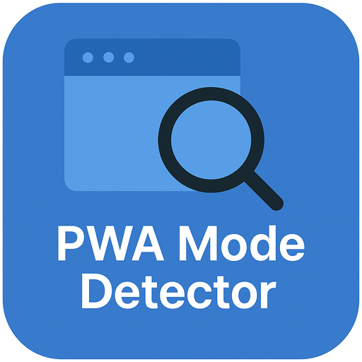

# PWA Display Mode Detector

<div align="center">
  
  <h3>A tool for demonstrating and testing different PWA display modes</h3>
</div>


English | [简体中文](./README.zh.md)

## Introduction

PWA Display Mode Detector is a tool designed for developers to demonstrate and test Progressive Web App (PWA) behavior and appearance across different display modes. This tool allows you to experience and compare the four main PWA display modes: `standalone`, `minimal-ui`, `fullscreen`, and `browser`.

<div align="center">
  
</div>

## Features

- ✅ **Real-time Mode Detection**: Automatically identifies the current PWA running mode
- ✅ **Multi-mode Support**: Test four different PWA display modes
- ✅ **Independent Installation**: Each mode can be installed as a separate PWA
- ✅ **Responsive Design**: Works well on various devices
- ✅ **User Agent Information**: Shows detailed browser information for the current environment
- ✅ **Install Button**: Provides intuitive installation experience in supported environments

## Four Display Modes

1. **Standalone Mode**: PWA runs in a standalone window without browser UI, similar to native applications
2. **Minimal UI Mode**: PWA runs in a window with minimal browser controls
3. **Fullscreen Mode**: PWA occupies the entire screen with no browser UI
4. **Browser Mode**: PWA runs in a regular browser tab

## Getting Started

### Online Demo

Visit [https://pwa-mode-detector.example.com](https://pwa-mode-detector.example.com) to see the online demo.

### Local Setup

1. Clone the repository
   ```bash
   git clone https://github.com/yourusername/pwa-mode-detector.git
   cd pwa-mode-detector
   ```

2. Install dependencies
   ```bash
   npm install
   ```

3. Start the development server
   ```bash
   npm run dev
   ```

4. Open `http://localhost:5000` in your browser

### Build for Production

```bash
npm run build
```

The generated files will be in the `dist` directory.

## Tech Stack

- **Frontend Framework**: React + TypeScript
- **Build Tool**: Vite
- **CSS Framework**: Tailwind CSS + shadcn/ui
- **Routing**: wouter
- **Data Fetching**: TanStack Query
- **Backend**: Express.js

## How It Works

The application works by:

1. User selects a PWA display mode to test from the home page
2. Each mode has its own `manifest.json` file that defines the `display` property and other relevant configurations
3. The app detects the current actual display mode using `window.matchMedia()`
4. Compares the actual mode against the expected mode, providing visual feedback
5. Each mode is configured with an independent `scope`, allowing them to be installed as separate PWAs simultaneously

## Contributing

Contributions are welcome! Please read the [contributing guidelines](CONTRIBUTING.md) to get started.

## License

This project is licensed under the MIT License - see the [LICENSE](LICENSE) file for details.

## Contact

For questions or suggestions, please contact us through:

- Submit a [GitHub issue](https://github.com/yourusername/pwa-mode-detector/issues)
- Send an email to [your-email@example.com](mailto:your-email@example.com)

---

<div align="center">
  <p>If this project helped you, please consider giving it a ⭐️</p>
  <p>Made with ❤️ for the PWA community</p>
</div>