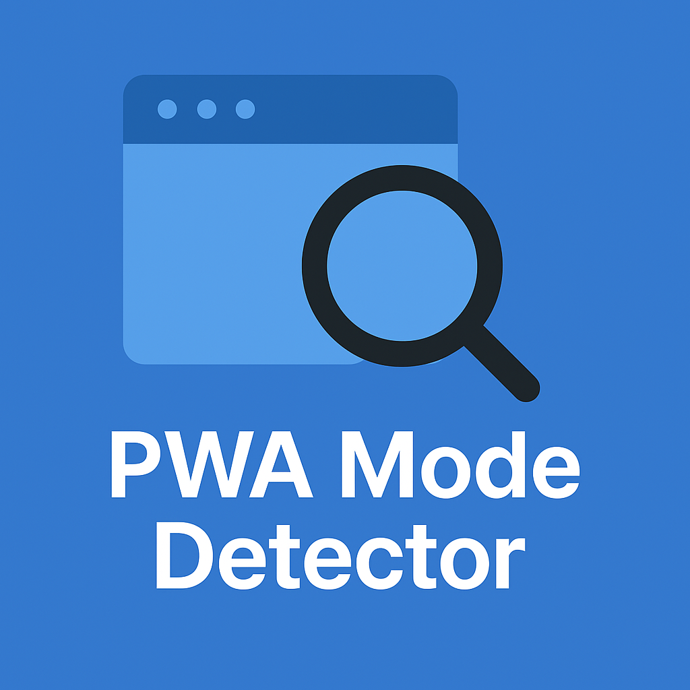

# PWA Mode Detector

<div align="center">
  
  <h3>A sophisticated tool for analyzing and testing Progressive Web App display modes</h3>
</div>


English | [简体中文](./README.zh.md)

## Introduction

PWA Mode Detector is an advanced tool designed for developers to analyze, demonstrate, and test Progressive Web App (PWA) behavior across different display modes. This application provides context-aware insights into how PWAs run in various environments, allowing you to experience and compare the four main PWA display modes: `standalone`, `minimal-ui`, `fullscreen`, and `browser`.

<div align="center">
  
</div>

## Key Features

- ✅ **Real-time Mode Detection**: Instantly identifies and monitors the current PWA running mode
- ✅ **Intelligent Context Analysis**: Provides detailed insights about the PWA running environment
- ✅ **Multi-mode Installation Testing**: Test installation and behavior of all four PWA display modes
- ✅ **Independent Scope Installation**: Each mode can be installed as a separate PWA simultaneously
- ✅ **Dynamic Manifest Management**: Automatically serves appropriate manifests based on user context
- ✅ **Granular Installability Analysis**: Determines exactly why a PWA is or isn't installable
- ✅ **User Agent and Browser Intelligence**: Shows detailed environment information
- ✅ **Multi-language Support**: Available in 8 languages with automatic detection
- ✅ **Responsive UI**: Works seamlessly across mobile, tablet, and desktop devices

## PWA APIs Used

The app leverages multiple Progressive Web App APIs and features:

| API/Feature | Description | Code Example |
|-------------|-------------|--------------|
| **Web App Manifest** | JSON file that controls how the app appears when installed | [App.tsx L106-119](https://github.com/dexteryy/pwa-mode-detector/blob/main/client/src/App.tsx#L106-L119) |
| **Dynamic Manifest Management** | Dynamically swaps manifest.json based on user context | [App.tsx L160-170](https://github.com/dexteryy/pwa-mode-detector/blob/main/client/src/App.tsx#L160-L170) |
| **Display Mode Media Queries** | Detects the current display mode | [usePwaDetection.ts L103](https://github.com/dexteryy/pwa-mode-detector/blob/main/client/src/hooks/usePwaDetection.ts#L103) |
| **iOS Standalone Detection** | Detects if an iOS PWA is running in standalone mode | [usePwaDetection.ts L106-108](https://github.com/dexteryy/pwa-mode-detector/blob/main/client/src/hooks/usePwaDetection.ts#L106-L108) |
| **beforeinstallprompt Event** | Triggers when a PWA is installable | [usePwaDetection.ts L220-237](https://github.com/dexteryy/pwa-mode-detector/blob/main/client/src/hooks/usePwaDetection.ts#L220-L237) |
| **appinstalled Event** | Detects when a PWA has been installed | [usePwaDetection.ts L241-258](https://github.com/dexteryy/pwa-mode-detector/blob/main/client/src/hooks/usePwaDetection.ts#L241-L258) |
| **Installation Prompt** | Prompts the user to install the PWA | [usePwaDetection.ts L314-348](https://github.com/dexteryy/pwa-mode-detector/blob/main/client/src/hooks/usePwaDetection.ts#L314-L348) |
| **getInstalledRelatedApps()** | Detects if the application is already installed | [usePwaDetection.ts L183-190](https://github.com/dexteryy/pwa-mode-detector/blob/main/client/src/hooks/usePwaDetection.ts#L183-L190) |
| **Display Mode Detection** | Comprehensive logic to detect current PWA mode | [usePwaDetection.ts L174-179](https://github.com/dexteryy/pwa-mode-detector/blob/main/client/src/hooks/usePwaDetection.ts#L174-L179) |
| **Dynamic Link Element Management** | Manipulates manifest link elements in the DOM | [App.tsx L85-89](https://github.com/dexteryy/pwa-mode-detector/blob/main/client/src/App.tsx#L85-L89) |
| **Visibility Change Detection** | Monitors app visibility to update PWA state | [usePwaDetection.ts L279-290](https://github.com/dexteryy/pwa-mode-detector/blob/main/client/src/hooks/usePwaDetection.ts#L279-L290) |

## How It Works

The application implements several advanced techniques:

1. **Dynamic Manifest Interception**: The server intercepts requests to different paths and serves the appropriate manifest.json file based on the requested display mode.

2. **Context-Aware PWA Detection**: The app uses multiple detection methods including:
   - `window.matchMedia('(display-mode: standalone)')` to detect current display mode
   - `navigator.getInstalledRelatedApps()` API where available
   - `BeforeInstallPromptEvent` to detect installation capability
   - iOS standalone mode detection via `navigator.standalone`

3. **Intelligent Installation Status Analysis**: The application uses a sophisticated algorithm to determine the exact reason why a PWA might not be installable:
   - Already running as a PWA
   - Browser doesn't support PWA installation
   - Manifest uses `display: browser` mode
   - Already installed but running in browser mode

4. **Manifest Scope Isolation**: Each display mode operates under its own scope (`/standalone`, `/minimal-ui`, etc.), allowing multiple installations of the same app with different display modes.

5. **Advanced Event Monitoring**: The app monitors display mode changes, visibility changes, and installation events to provide real-time updates without page refreshes.

6. **Internationalization with Term Linking**: Uses i18next with a custom system to automatically add reference links to key technical terms for educational purposes.

## Getting Started

### Local Setup

1. Clone the repository
   ```bash
   git clone https://github.com/yourusername/pwa-mode-detector.git
   cd pwa-mode-detector
   ```

2. Install dependencies
   ```bash
   npm install
   ```

3. Start the development server
   ```bash
   npm run dev
   ```

4. Open `http://localhost:5000` in your browser

### Build for Production

```bash
npm run build
```

The generated files will be in the `dist` directory.

## Tech Stack

- **Frontend**: React 18 with TypeScript
- **State Management**: React Hooks + Context API
- **Build System**: Vite with HMR (Hot Module Replacement)
- **Styling**: Tailwind CSS with theme customization + shadcn/ui components
- **Routing**: wouter (lightweight React router)
- **API Client**: TanStack Query (React Query v5)
- **Backend**: Express.js server with dynamic manifest management
- **Internationalization**: i18next with language auto-detection
- **PWA Features**: Web App Manifest, installability detection, display mode media queries
- **Development Tools**: TypeScript, ESLint, Prettier

## Multi-language Support

The application supports 8 languages with automatic browser language detection:

- English (en)
- Simplified Chinese (zh)
- Traditional Chinese (zh-TW)
- Japanese (ja)
- Korean (ko)
- German (de)
- French (fr)
- Spanish (es)
- Portuguese (pt)

## Contributing

Contributions are welcome! Please read the [contributing guidelines](CONTRIBUTING.md) to get started.

## License

This project is licensed under the MIT License - see the [LICENSE](LICENSE) file for details.

## Contact

For questions or suggestions, please contact us through:

- Submit a [GitHub issue](https://github.com/yourusername/pwa-mode-detector/issues)
- Send an email to [your-email@example.com](mailto:your-email@example.com)

---

<div align="center">
  <p>If this project helped you, please consider giving it a ⭐️</p>
  <p>Made with ❤️ for the PWA community</p>
</div>