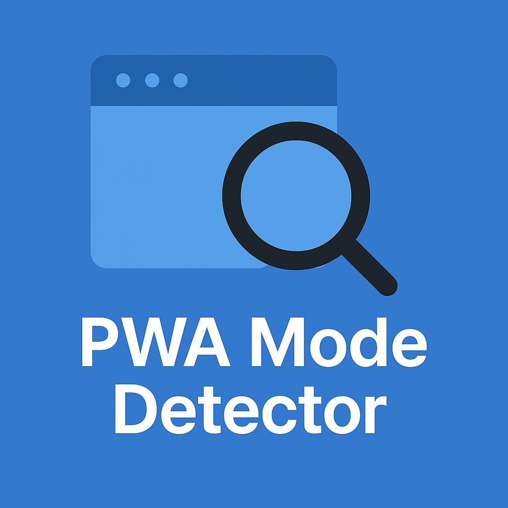

# PWA 模式检测器

<div align="center">
  
  <h3>一个用于分析和测试渐进式Web应用显示模式的高级工具</h3>
</div>


[English](./README.md) | 简体中文

## 简介

PWA 模式检测器是一款为开发者设计的高级工具，用于分析、展示和测试渐进式Web应用（PWA）在不同显示模式下的行为。该应用提供了关于PWA如何在各种环境中运行的上下文感知分析，让你能够体验和比较四种主要的PWA显示模式：`standalone`（独立窗口）、`minimal-ui`（最小界面）、`fullscreen`（全屏）和 `browser`（浏览器）。

<div align="center">
  
</div>

## 核心功能

- ✅ **实时模式监测**：即时识别并持续监控当前PWA的运行模式
- ✅ **智能上下文分析**：提供关于PWA运行环境的详细洞察
- ✅ **多模式安装测试**：测试所有四种PWA显示模式的安装和行为
- ✅ **独立作用域安装**：每种模式都可以作为独立PWA同时安装
- ✅ **动态清单管理**：根据用户上下文自动提供适当的清单文件
- ✅ **细粒度可安装性分析**：精确确定PWA为何可安装或不可安装
- ✅ **用户代理与浏览器智能**：显示详细的环境信息
- ✅ **多语言支持**：支持8种语言，自动检测用户语言
- ✅ **响应式UI**：在移动设备、平板电脑和桌面设备上无缝运行

## 使用的PWA API

本应用利用了多种渐进式Web应用API和特性：

| API/特性 | 描述 | 代码示例 |
|-------------|-------------|--------------|
| **Web应用清单** | 控制应用安装后外观的JSON文件 | [App.tsx L106-119](https://github.com/dexteryy/pwa-mode-detector/blob/main/client/src/App.tsx#L106-L119) |
| **动态清单管理** | 根据用户上下文动态切换manifest.json | [App.tsx L160-170](https://github.com/dexteryy/pwa-mode-detector/blob/main/client/src/App.tsx#L160-L170) |
| **显示模式媒体查询** | 检测当前显示模式 | [usePwaDetection.ts L103](https://github.com/dexteryy/pwa-mode-detector/blob/main/client/src/hooks/usePwaDetection.ts#L103) |
| **iOS独立模式检测** | 检测iOS PWA是否在独立模式下运行 | [usePwaDetection.ts L106-108](https://github.com/dexteryy/pwa-mode-detector/blob/main/client/src/hooks/usePwaDetection.ts#L106-L108) |
| **beforeinstallprompt事件** | 当PWA可安装时触发 | [usePwaDetection.ts L220-237](https://github.com/dexteryy/pwa-mode-detector/blob/main/client/src/hooks/usePwaDetection.ts#L220-L237) |
| **appinstalled事件** | 检测PWA何时已被安装 | [usePwaDetection.ts L241-258](https://github.com/dexteryy/pwa-mode-detector/blob/main/client/src/hooks/usePwaDetection.ts#L241-L258) |
| **安装提示** | 提示用户安装PWA | [usePwaDetection.ts L314-348](https://github.com/dexteryy/pwa-mode-detector/blob/main/client/src/hooks/usePwaDetection.ts#L314-L348) |
| **getInstalledRelatedApps()** | 检测应用是否已经安装 | [usePwaDetection.ts L183-190](https://github.com/dexteryy/pwa-mode-detector/blob/main/client/src/hooks/usePwaDetection.ts#L183-L190) |
| **显示模式检测** | 检测当前PWA模式的综合逻辑 | [usePwaDetection.ts L174-179](https://github.com/dexteryy/pwa-mode-detector/blob/main/client/src/hooks/usePwaDetection.ts#L174-L179) |
| **动态链接元素管理** | 在DOM中操作清单链接元素 | [App.tsx L85-89](https://github.com/dexteryy/pwa-mode-detector/blob/main/client/src/App.tsx#L85-L89) |
| **可见性变化检测** | 监控应用可见性以更新PWA状态 | [usePwaDetection.ts L279-290](https://github.com/dexteryy/pwa-mode-detector/blob/main/client/src/hooks/usePwaDetection.ts#L279-L290) |

## 工作原理

该应用实现了多种高级技术：

1. **动态清单拦截**：服务器拦截对不同路径的请求，并根据请求的显示模式提供适当的manifest.json文件。

2. **上下文感知PWA检测**：应用使用多种检测方法，包括：
   - `window.matchMedia('(display-mode: standalone)')` 检测当前显示模式
   - 可用时使用 `navigator.getInstalledRelatedApps()` API
   - 使用 `BeforeInstallPromptEvent` 检测安装能力
   - 通过 `navigator.standalone` 检测iOS独立模式

3. **智能安装状态分析**：应用使用复杂算法确定PWA不可安装的确切原因：
   - 已经作为PWA运行
   - 浏览器不支持PWA安装
   - 清单使用 `display: browser` 模式
   - 已安装但在浏览器模式下运行

4. **清单作用域隔离**：每种显示模式在自己的作用域下运行（`/standalone`, `/minimal-ui`等），允许同一应用的多种不同显示模式同时安装。

5. **高级事件监控**：应用监控显示模式变化、可见性变化和安装事件，提供实时更新而无需刷新页面。

6. **带术语链接的国际化**：使用i18next，并配备自定义系统，自动为关键技术术语添加参考链接，用于教育目的。

## 开始使用

### 本地运行

1. 克隆仓库
   ```bash
   git clone https://github.com/yourusername/pwa-mode-detector.git
   cd pwa-mode-detector
   ```

2. 安装依赖
   ```bash
   npm install
   ```

3. 启动开发服务器
   ```bash
   npm run dev
   ```

4. 在浏览器中打开 `http://localhost:5000`

### 构建生产版本

```bash
npm run build
```

生成的文件将位于 `dist` 目录中。

## 技术栈

- **前端**：React 18 + TypeScript
- **状态管理**：React Hooks + Context API
- **构建系统**：Vite 带热模块替换（HMR）
- **样式**：Tailwind CSS 主题定制 + shadcn/ui 组件
- **路由**：wouter（轻量级React路由器）
- **API客户端**：TanStack Query（React Query v5）
- **后端**：Express.js 服务器，带动态清单管理
- **国际化**：i18next 带语言自动检测
- **PWA功能**：Web App Manifest, 可安装性检测, 显示模式媒体查询
- **开发工具**：TypeScript, ESLint, Prettier

## 多语言支持

该应用支持8种语言，并自动检测浏览器语言：

- 英语 (en)
- 简体中文 (zh)
- 繁体中文 (zh-TW)
- 日语 (ja)
- 韩语 (ko)
- 德语 (de)
- 法语 (fr)
- 西班牙语 (es)
- 葡萄牙语 (pt)

## 贡献

欢迎贡献！请阅读 [贡献指南](CONTRIBUTING.zh.md) 了解如何开始。

## 许可证

本项目采用 MIT 许可证 - 查看 [LICENSE](LICENSE) 文件了解详情。

## 联系方式

如有问题或建议，请通过以下方式联系我们：

- 提交 [GitHub issue](https://github.com/yourusername/pwa-mode-detector/issues)
- 发送邮件至 [your-email@example.com](mailto:your-email@example.com)

---

<div align="center">
  <p>如果这个项目对你有帮助，请考虑给它一个⭐️</p>
  <p>用❤️为PWA社区倾心打造</p>
</div>